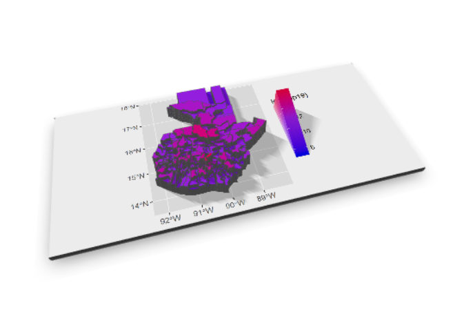

# Guatemala

This is my final project on Guatemala

## Administrative Boarders

Th
The map of Guatemala and the Guatemala Department. Guatemala is 1 country, 22 departments, and 333 municipalities. The Guatemala departmet is the most populated department. The second most populated department in the Guatemala department is Alta Verapaz. 

Then within the Guatemala department there is the largest municipality Guatemala City. The most populated area, according to cencus data, within Guatemala City is Villa Nueva. Above are the maps of Villa Nueva and Guatemala City with thier populations generated by random foresting.

## Population of Guatemala

### The Population by department

As illustrated by the map and bar graph the Guatemala department is by far the most populated area. The northern part of Guatemala is the least populated area. The northern area is mostly used for farming or mining. 

### Population by municipality

The most populated area in the Guatemala department is Guatemala City.

### 3D representation of population by department

