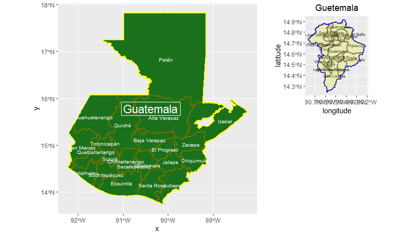
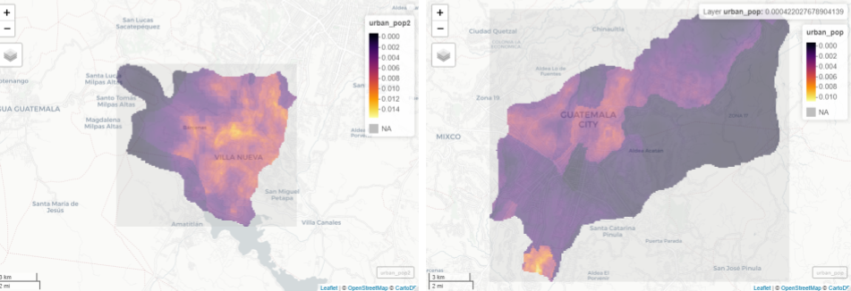
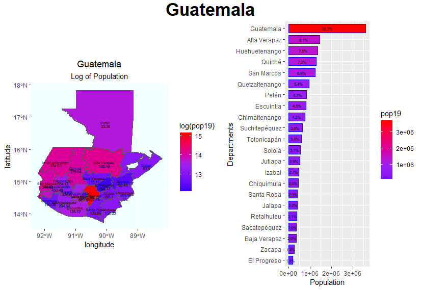
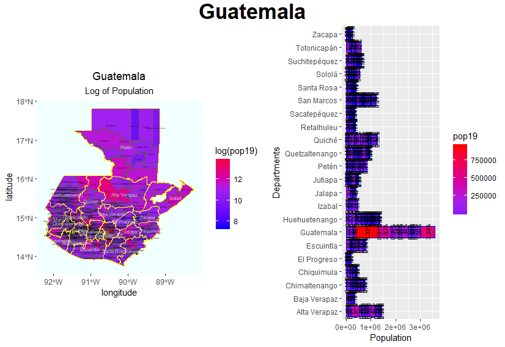
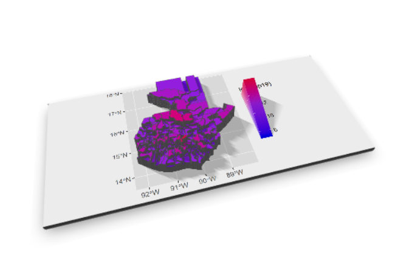
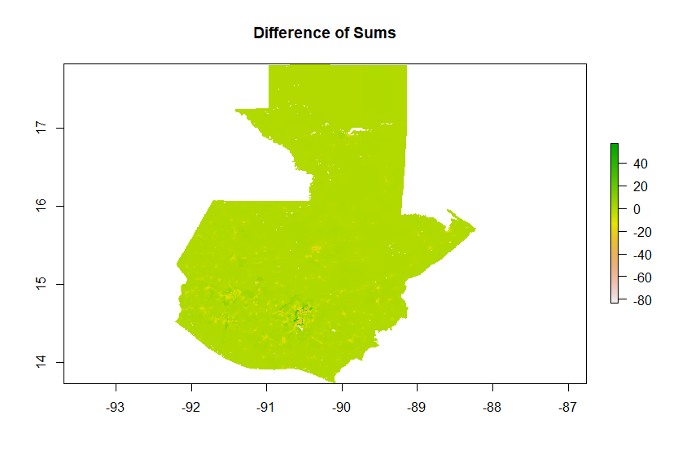
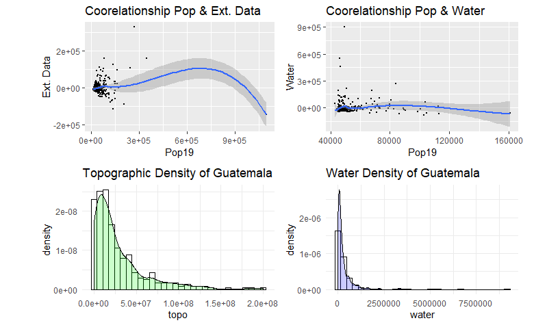
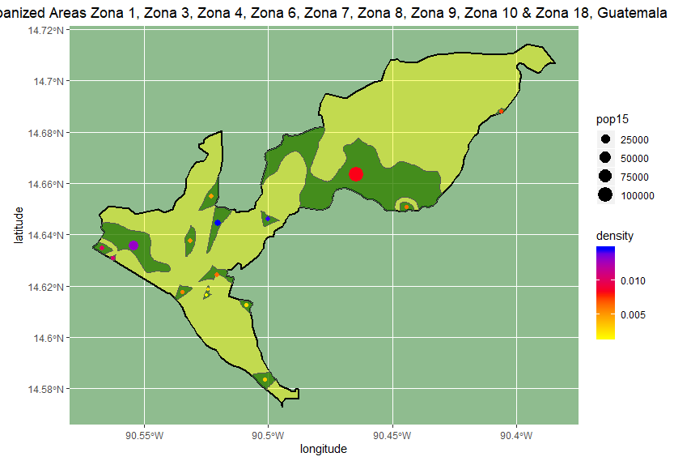
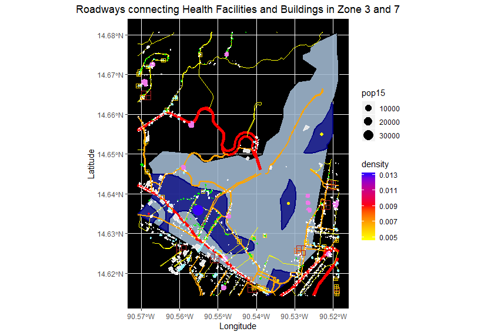
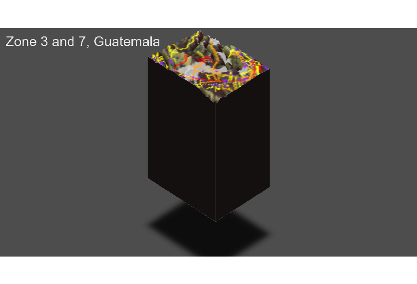

# Guatemala

This is my final project on Guatemala. Over the semester I have used random foresting to come up with a more acurate repesentation of Guatemala's population. I used the population data to analize how the urbanized areas are related to roads, health care facilities, and types of buildings.

## Administrative Boarders

Th
The map of Guatemala and the Guatemala Department. Guatemala is 1 country, 22 departments, and 333 municipalities. The Guatemala departmet is the most populated department. The second most populated department in the Guatemala department is Alta Verapaz. 

Then within the Guatemala department there is the largest municipality Guatemala City. The most populated area, according to cencus data, within Guatemala City is Villa Nueva. Above are the maps of Villa Nueva and Guatemala City with thier populations generated by random foresting.

## Population of Guatemala

### The Population by department

As illustrated by the map and bar graph the Guatemala department is by far the most populated area. The northern part of Guatemala is the least populated area. The northern area is mostly used for farming or mining. 

### Population by municipality

The most populated area in the Guatemala department is Guatemala City.

### 3D representation of population by department

When generating the population using data such as amount of water, topography, ect. My most accurate model came from my summed data. I know this because it had the smallest range of error. The error for my summed data was 8120344, mean was 9344418, logpop was 8188914, and random foresting was 928638. All of the data was similar, but the summed data was slightly more accurate.

When using satalite data to determine population, I looked at the relationship between some variables and their relationship to the population.

## Urban Populations
By using random foresting I was able to determine which areas had the highest density. The areas with a higher density can be assumed to be more urban. I Found the urban areas in Guatemala City for Zone 1, 3, 4, 6, 7, 8, 9, 10, and 18.

I noticed that the richer Zones had lower densities than the poorer zones. 

I focused on Zones 3 and 7 to look into deeper. I mapped out primary, secondary, and tercherary roads. Then I placed the health care facilities and different types of buildings. The roads connected all of the urban populations. All of the health care facilities and commercial buildings were along the roads and within the urbanized areas.

|Admin Name|Urban Areas                          |Roadways                       |Health Care Facilities                             |
|----------|-------------------------------------|-------------------------------|---------------------------------------------------|
|Zona 3 & 7|# : **5**                            |# of primary : **61**          |# : **48**                                         |
|          |Largest population: **32,851 people**|# of secondary: **220**        |# of people per facility: **3,621 people/facility**|
|          |                                     |Length of roads: **672659.4 m**|                                                   |

When adding the geography, you can see thatthe urbanized areas are located so they are not in the valleys or on the peaks. The peaks are created by volcanos and would be hard to live on. The valleys are where people dump their trash, so very few people would live in them.

Guatemala is set up to give those with money and power acess to many things such as health care facilities. Even though the health care facilities are set up in and around the urbanized areas, most of those living in the urbanized areas do not have the financial means to use them.
