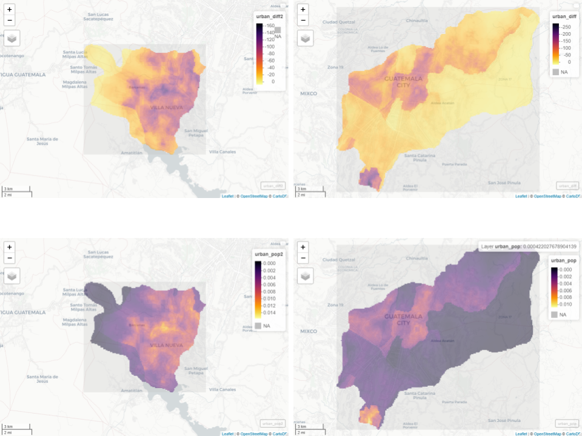

# Guatemala

This is my final project on Guatemala

## Administrative Boarders

The map of Guatemala and the Guatemala Department. Guatemala is 1 country, 22 departments, and 333 municipalities. The Guatemala departmet is the most populated department. Then within the Guatemala department there is the largest municipality Guatemala City. The second largest municipality in the Guatemala department is Villa Nueva. 

## Population of Guatemala Departments

## Population of Guatemala Municipalities

